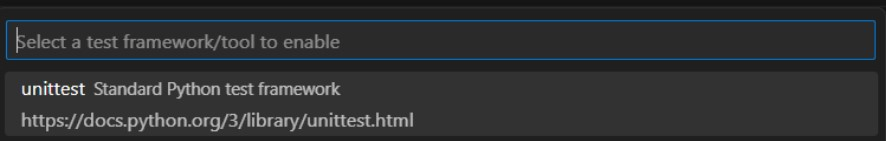
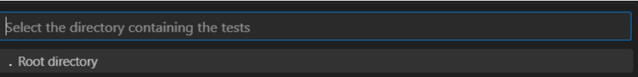

# NTB Biluthyrning
Website for NTB Biluthyrning 2023/2024  
[Link to live website](https://ntig-uppsala.github.io/ntbbiluthyrning/)

## Standard for coding
* 4 Space Indentation
* The naming convention used is camelcase

## Development environment standard
### Os
* Windows 10
### Code Editor
* Visual Studio Code Version: 1.82.2
### Testing
* Selenium 4.11.2
### Scss compiler
* Sass 1.66.1

## Programming Languages
* HTML5
* CSS3
* Javascript ES13
* Bootstrap 5.3.1
* Python 3.11

## Documentation
### Visual Studio Code (VS Code)
#### Download
* [Link to download](https://code.visualstudio.com/Download)
* Install the version for your OS and follow the instructions
#### Extensions
* Black Formatter
* isort
* Pylint
### Python
* [Link to download](https://www.python.org/downloads/)
* Download the latest version as demonstrated below:    

* Press next until a new tab opens
* In the new tab press "Add python.exe to environment variables"
* Continue pressing until the installation is complete
* In Visual Studio Code add the extension Python by Microsoft
### Selenium
* In VS Code open the terminal
* Input "py -m pip install selenium"
* While having the test.py open in VS Code open the testing tab as illustrated in the image below:    

* If you are unable to find the testing tab go to "view" at the top of VS Code and press testing as shown below    

* When the testing tab is open, press the blue "Configure Python Tests" button
* Next choose "unittest" as displayed below:    

* Next choose "Root directory" as displayed below:    

* Lastly choose "test*.py" so that all files beginning their name with test will be run as demonstrated below:   

### Node.js
#### Download
* [Link to download](https://nodejs.org/en)
* Download the the recommended version (LTS) as showcased below:    

#### Usage
* Node modules are installed through Node Package Manager (npm)
* To use Node Package Manager input "npm install" followed by the module/package into cmd or other terminal
* To install packages/modules globally add -g in between install and the module/package
#### Install the modules used in a project
* To install the modules used by a project first open the project in VS Code
* Open the terminal
* Input "npm install" into the terminal
* The packages/modules documented in the package.json will now be installed locally
### Sass
* Sass is used in order to customize Bootstrap css using scss
#### Download
* To install Sass, input "npm install -g sass" into the cmd
* [For other methods of installment click here](https://sass-lang.com/install/)
#### Compiling
* First create a folder for scss documents (in this project that folder is "scss/")
* Create a scss file (in this project that file is custom.scss) where the last line is the source sass files
* In this project the source sass files are bootstraps
* To import the source sass files from bootstrap this line is used "@import "../node_modules/bootstrap/scss/bootstrap";"
* Then create a css folder or use an existing one
* To compile Sass, input "sass ./scss/custom.scss ./css/custom.css"
* "sass" is the command used to compile scss
* "./scss/custom.scss" is the path to the scss file
* "./css/custom.css" is the path to the css file

## Definition of Done
* Everyone present (at least two) has to agree it is done.
* Everyone should have access to the finished assignment.
* It must fulfill the conditions of the assignment.
* All installations must be documented.
* Use no placeholders.
* It follows the product goal.
* Everyone needs to be caught up on what has happened.
* It is presentable.
### If it is code then it also needs to fulfill the following conditions:
* The code has to be checked in our revision control.
* All comments have to be finished.
* All tests must be done and the code must pass them.
* The code works and does what it is supposed to do.
* If it is HTML or CSS, it must be validated by [W3C HTML validator](https://validator.w3.org/) and [W3C CSS Validator](https://jigsaw.w3.org/css-validator/) before it is uploaded.
* The code should compile without error.

## Licenses
### Fonts
  * [Maven Pro](https://fonts.google.com/specimen/Maven+Pro/about?query=maven+pro)
### Images
  * [lineofcar](https://pixabay.com/photos/automobile-mercedes-mercedes-benz-1291491/)
  * [mapcar](https://unsplash.com/photos/5A8BS9CG-G0?modal=%7B%22tag%22%3A%22Login%22%2C%22value%22%3A%7B%22tag%22%3A%22Like%22%2C%22value%22%3A%7B%22photoId%22%3A%225A8BS9CG-G0%22%2C%22userId%22%3A%22Ov7UOZaHAxA%22%7D%7D%7D)
  * [mountaincar](https://www.pexels.com/sv-se/foto/man-par-manniskor-berg-1131575/)
  
